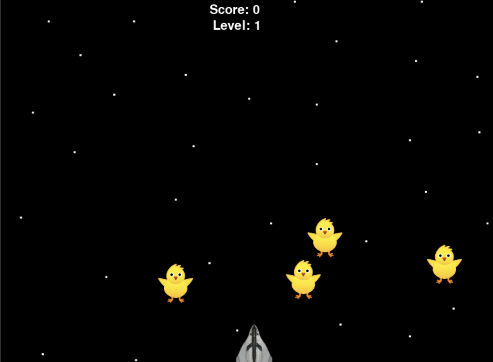

# Space Invader



## Overview
Space Invader is a fun 2D arcade-style game built with Python where players control a spaceship to shoot down duck-shaped invaders. Navigate your ship to avoid collisions while targeting and eliminating the descending ducks to earn points and advance through levels.

## Game Features
- **Simple Controls**: Use arrow keys to move and spacebar to shoot
- **Progressive Difficulty**: Game speed increases as you advance through levels
- **Score System**: Earn points for each duck you shoot down
- **Game States**: Experience different game states (playing, game over, victory)

## How to Play

### Controls
- **Left/Right Arrow Keys**: Move your spaceship horizontally
- **Spacebar**: Fire lasers at the invading ducks

### Objective
Shoot down the duck invaders before they reach the bottom of the screen or collide with your ship. Reach a score of 200 points to win the game!

### Game Progression
- **Level 1**: Standard speed
- **Level 2**: Unlocked at 100 points - Increased duck speed
- **Level 3/Victory**: Achieved at 200 points

## Game Elements
- **Spaceship**: Player-controlled defender
- **Ducks**: The invading enemies you must shoot down
- **Lasers**: Your weapon against the invaders
- **Space Background**: The cosmic battlefield

## Technical Requirements
- Python 3.10 or higher
- Pygame Zero library

## Installation

1. Ensure you have Python 3.10+ installed
2. Install Pygame Zero:
   ```
   pip install pgzero
   ```
3. Run the game:
   ```
   python space.py
   ```
   or open with IDLE and run from there

## Development
This game was developed using Pygame Zero, a beginner-friendly game framework for Python that simplifies game development while teaching programming concepts.

## Credits
Game developed as part of a portfolio project, showcasing skills in game design and Python programming.

---

Enjoy playing Space Invader! If you encounter any issues or have suggestions for improvements, please let me know.
